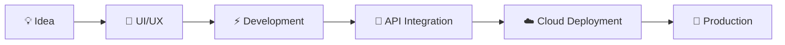

<div align="center">

# ⚡ ABITH JERI VINITH


<br>


</div>

---

<div align="center">


</div>

# 🧠 About Me


```yaml
name: Abith Jeri Vinith
located_in: UAE 🇦🇪
current_role: Director @ Shadobooks ERP Solutions

specialized_in:
  - ERP Development
  - CRM Solutions
  - Accounting Systems
  - Mobile Applications
  - API Integrations
  - Cloud Platforms

currently_learning:
  - AI Integrations
  - Advanced React Architecture
  - System Scalability
  - DevOps & Automation

life_philosophy:
  "Build products that solve real business problems."
```

<br><br>

---

# 🚀 Tech Arsenal

<div align="center">


</div>

---

# ⚡ Current Ecosystem

<div align="center">

| Platform | Description |
|---|---|
| 🧾 ERP | Accounting, Inventory, HRM |
| 🤝 CRM | Sales & Customer Management |
| ☁️ Cloud Drive | Document & File Storage |
| 📱 Mobile Apps | Flutter Based Applications |
| 📊 Analytics | Business Insights & Reports |
| 🤖 AI Integrations | Smart Automation Systems |

</div>

---

# 📈 GitHub Analytics

<div align="center">


</div>

<div align="center">


</div>

---

# 🏆 Achievements

<div align="center">


</div>

---

# 🌐 Connect With Me

<div align="center">

<a href="https://linkedin.com/in/abithjerivinth">
  
</a>

<a href="https://instagram.com/shifter_vr46">
  
</a>

<a href="https://twitter.com/abithjvinith">
  
</a>

<a href="mailto:abithjvinith@gmail.com">
  
</a>

</div>

---

# ⚙️ Development Workflow

<div align="center">



</div>

---

# 🧩 Currently Working On

- 🚀 Next Generation ERP Platform
- ☁️ Cloud Workspace Ecosystem
- 📱 Cross Platform Mobile Apps
- 🤖 AI Powered Business Tools
- 🔐 Secure Enterprise Systems

---

# 💻 Random Dev Quote

<div align="center">


</div>

---

<div align="center">

### ⚡ "Turning complex business ideas into scalable digital products."

<br>


</div>
