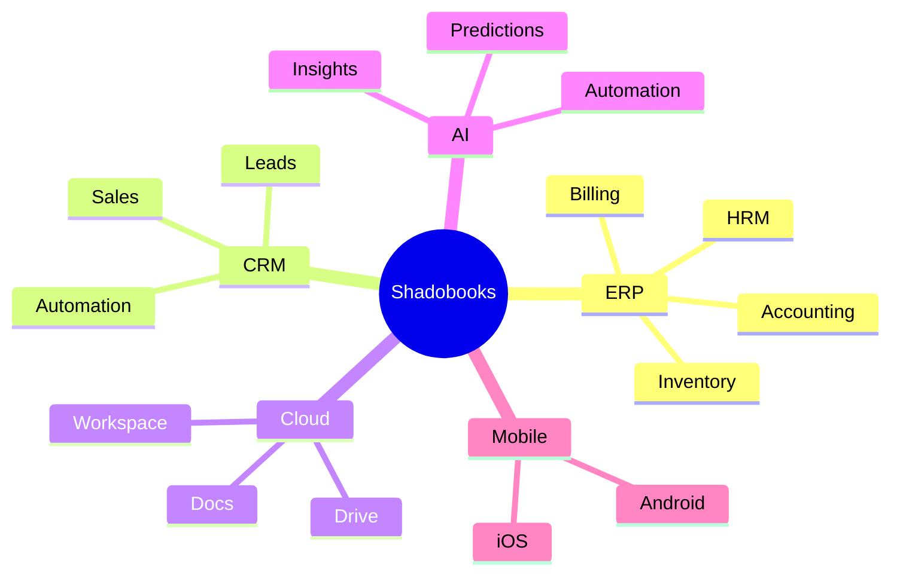
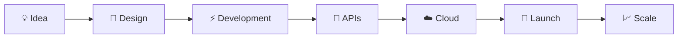

<div align="center">


<br>


</div>

---

<div align="center">

# ⚡ DIGITAL ARCHITECT • PRODUCT BUILDER • VISIONARY DEVELOPER ⚡


</div>

---

# 🧠 SYSTEM.INFO()


```yaml
class Developer:

  name: "Abith Jeri Vinith"

  role: "Full Stack Engineer"

  company: "Shadobooks ERP Solutions"

  location: "UAE 🇦🇪"

  specialization:
    [
      "ERP Development",
      "CRM Ecosystems",
      "Accounting Platforms",
      "Cloud Infrastructure",
      "Mobile Applications",
      "AI Integrations",
      "Enterprise Automation"
    ]

  tech_stack:
    [
      "React",
      "Next.js",
      "Flutter",
      "Node.js",
      "Laravel",
      "Python",
      "NestJS",
      "MongoDB",
      "MySQL"
    ]

  currently_building:
    "The Future Workspace Ecosystem"

  motto:
    "Build. Scale. Dominate."
```

<br><br><br><br>

---

# 🚀 TECH ECOSYSTEM

<div align="center">


</div>

---

# ⚙️ ACTIVE TECH STACK

<div align="center">

<table>
<tr>
<td align="center" width="200">

<br><br>
<b>Frontend</b>
<br>
React • Next.js
<br>
Tailwind • TypeScript
</td>

<td align="center" width="200">

<br><br>
<b>Backend</b>
<br>
Node.js • Laravel
<br>
Python • NestJS
</td>

<td align="center" width="200">

<br><br>
<b>Database</b>
<br>
MySQL • MongoDB
<br>
Firebase
</td>

<td align="center" width="200">

<br><br>
<b>Mobile</b>
<br>
Flutter
<br>
React Native
</td>
</tr>
</table>

</div>

---

# 🌌 SHADOBOOKS ECOSYSTEM

<div align="center">



</div>

---

# 📊 PERFORMANCE ANALYTICS

<div align="center">


</div>

<div align="center">


</div>

---

# 🏆 ACHIEVEMENTS UNLOCKED

<div align="center">


</div>

---

# 🌐 CONNECT.DIGITAL()

<div align="center">

<a href="https://linkedin.com/in/abithjerivinth">

</a>

<a href="https://instagram.com/_explorx_">

</a>

<a href="https://twitter.com/abithjvinith">

</a>

<a href="mailto:abith@shadobooks.com">

</a>

</div>

---

# ⚡ DEVELOPMENT PIPELINE

<div align="center">



</div>

---

# 🔥 CURRENT MISSIONS

<div align="center">

| 🚀 Project | ⚡ Status |
|---|---|
| Enterprise ERP Platform | ACTIVE |
| AI Business Automation | IN PROGRESS |
| Cloud Workspace Ecosystem | BUILDING |
| Flutter Mobile Suite | SCALING |
| Enterprise APIs | OPTIMIZING |

</div>

---

# 💎 PHILOSOPHY

<div align="center">


</div>

---

<div align="center">

# ⚡ BUILDING THE FUTURE OF BUSINESS SOFTWARE ⚡


</div>
